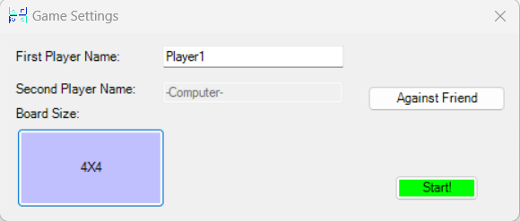
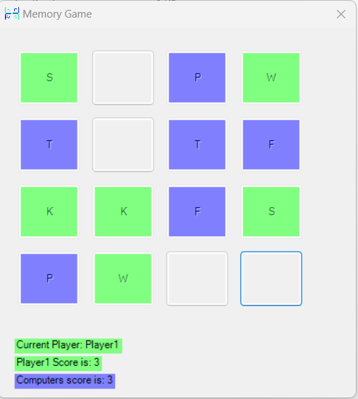
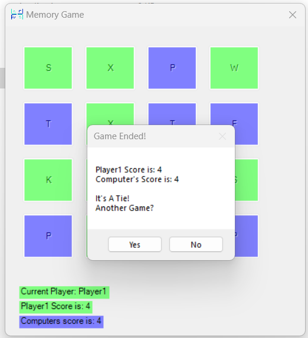

# Memory Game

Welcome to the Memory Game! This project was developed as part of a C# and .NET course, aiming to provide an entertaining and educational experience.

  
  

## How to Run

To run the game, you have two options:

1. **Visual Studio:** Open the provided solution in Visual Studio and run it directly from the IDE.

2. **Executable:** Alternatively, you can run the executable file located at `MemoryGame\MemoryGame\bin\Debug\MemoryGame.exe`.

## Features

- **User-friendly Interface:** The game offers a simple and intuitive interface for seamless gameplay.
- **Customizable Difficulty:** Depending on the user's preference, the game can be adjusted for different levels of difficulty in grid size.
- **Interactive Gameplay:** Players can interact with the game by clicking on cards to reveal their symbols and attempt to find matching pairs.
- **Score Tracking:** Keep track of your performance with a scoring system that rewards efficient matches and completion time.

## Development

This game was developed using C# and the .NET framework. It demonstrates fundamental programming concepts such as object-oriented design, event handling, and user interface development.

## Contributors

- Aviel Nisanov - Avielnis222@gmail.com
- Daniel Mangesto - Danielmangesto@gmail.com
